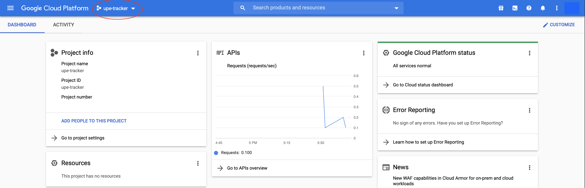
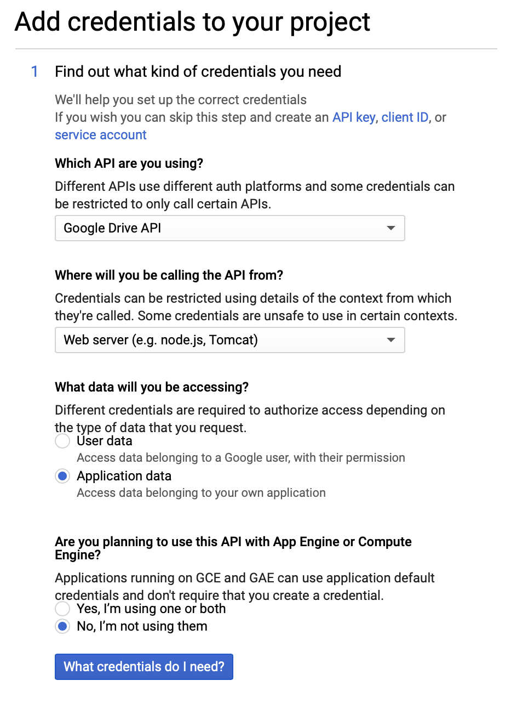
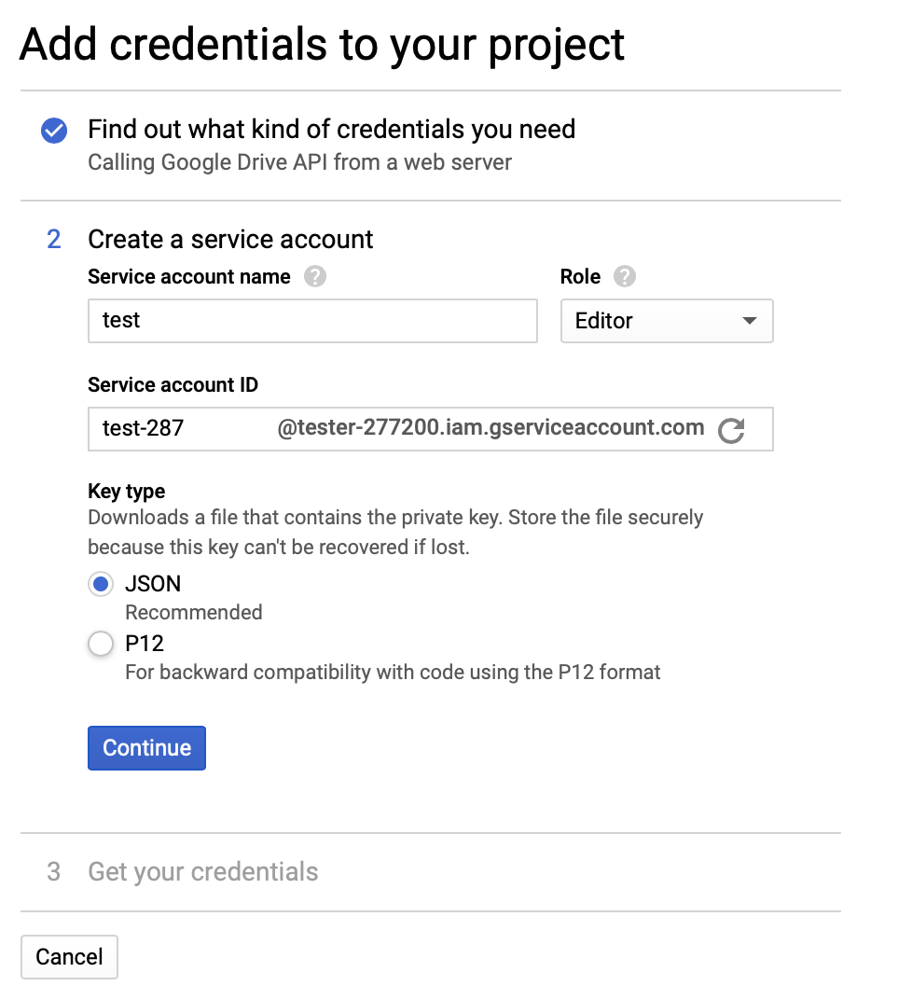
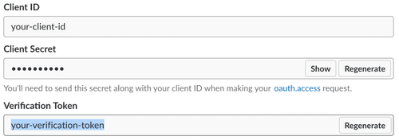
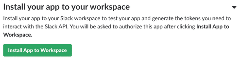

# UPE Slack Bot

## Table Of Contents
  - [About](#about)
  - [Commands](#commands)
  - [Changing Semesters](#changing-semesters)
    - [Candidacy Spreadsheet Requirements](#candidacy-spreadsheet-requirements)
    - [Integrating Slack Bot](#integrating-slack-bot)
  - [Getting Started](#getting-started)
    - [Prerequisites](#prerequisites)
    - [Installation](#installation)
  - [Deployment](#deployment)
    - [OCF WebApp Deploy](#ocf-webapp-deploy)
    - [OCF Server Maintenance](#ocf-server-maintenance)
  - [History](#history)
  - [Author](#author)

## About

## Commands
The current live commands are as follows
- `\check <candidate name>` - looks up candidates inside the candidacy spreadsheet and returns the set of requirements left prior to initiation
- `\checkoff <INSERT VALUES HERE>` - marks specified task for the given candidate as complete in the spreadsheet, given correct access controls

## Changing Semesters
The following directions are the steps required for a fluid transition between Slack channels for the Slack bot to function as intended. Please follow the directions step by step as one mistake will prevent the bot from functioning properly.

### Candidacy Spreadsheet Requirements

### Integrating Slack Bot

## Getting Started
NOTE: This shouldn't be necessary as the bot is already up and running. Please refer to [Changing Semesters](#changing-semesters) for mitrating the slackbot to the following semester. This section is only used for reference when adding additional implementations towards the slackbot.

### Prerequisites
<details><summary>Install these packages in not already done so on the SSH UPE server.</summary>
<p>

```
pip install gspread
pip install oauth2client
pip install flask
pip install gunicorn
```
</p>
</details>

### Installation
<details>
<p>
Creating API endpoint to access the Google Sheets  

1. Go to [Google Cloud Console](https://console.cloud.google.com/home) and create a new project. Name the project as desired
2. Go to the dashboard of the project by clicking the top left dropdown  
   
    

3. Search for `Google Drive API` using the search bar in the middle of the screen
4. Enable Google Drive API and click `Create Credentials` on the left side
5. Fill the form as indicated
   
     </br> 

    
6. Download the JSON credentials file created and rename it into `creds.json`
7. Search for `Google Sheets API` using the search bar and click Enable
8. Copy the `client email` value from our JSON file and share it with the desired spreadsheet  
   This should allow the API to have access to the sheet

Retrieve Slack Bot Information
1. Go to [Slack](https://api.slack.com/) > Your Apps (top right) > Create New App  
   Create a new app for the desired workspace
2. Scroll to `Verification Token` and copy it  
   
     

3. Click on `Add featuress and functionality` > `Slash Commands` > `Create New Command`  
   Fill out the contents indicated  

     

4. Go back to the app's `Basic Information` > click `Install App to Workspace`  
   
     

5. Using a browser, go to the desired workspace and copy the `Team ID` specificed as  
   ```
   https://app.slack.com/client/<team id here>/
   ```

6. See [OCF WebApp Deploy](#ocf-webapp-deploy) to directions on deploying

</p>
</details>

## Deployment
Currently, our bot is hosted on Berkeley's Open Computing Facility Servers  

### OCF WebApp Deploy
1. SSH into the UPE directory
2. **Edit the `run*` file with the new semester contents**
Fill in the values with the Slack IDs specified above
```
export SLACK_VERIFICATION_TOKEN=your-verification-token
export SLACK_TEAM_ID=your-team-id
```
3. run the command `systemctl --user restart <insert app name here>` to restart the OCF Serverr

Please visit OCF's website and follow their directions on how to properly deploy web apps on their server
- [OCF Home](https://www.ocf.berkeley.edu)
- [App Hosting](https://www.ocf.berkeley.edu/docs/services/webapps/)
- [Python WebApps](https://www.ocf.berkeley.edu/docs/services/webapps/python/)

### OCF Server Maintenance
There are a couple useful commands when debugging. For every `<insert app name here>`, please insert `slackbot`
- *Restart an app* - `systemctl --user restart <insert app name here>`
- *Bring an app offline* - `systemctl --user stop <insert app name here>`
- *Bring an app back online* - `systemctl --user start <insert app name here>`
- *Check status of an app* - `systemctl --user status <insert app name here>`
- *Check debug log for app* - `journalctl --user -n <insert number of lines>`

## History
(Last Updated: 05-14-2020)  
This project was the birth of the software developer (softdev) committee. During the Spring 2020 semester, the issue of having candidates to constantly find the location of the candidacy spreadsheet over and over was brought up by Celina, a former treasurer. Initially, the Slack bot was meant for candidates to have a simpler method of accessing their requirements, but the usefulness of such bot became apparently for other commands.

## Author
- Wallace Lim (Sp20 Software Dev)
- Leon Ming (Sp20 President)