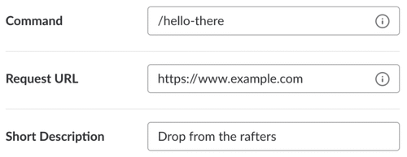

# UPE Slack Bot

## Table Of Contents
  - [Background](#background)
    - [Motivation](#motivation)
    - [Goals](#goals)
  - [Commands](#commands)
  - [Getting Started](#getting-started)
    - [Prerequisities](#prerequisities)
    - [Directory Layout](#directory-layout)
    - [Documentation](#documentation)
  - [Adding a Command](#adding-a-command)
    - [Mitigating Slack's 3 second rule](#mitigating-slacks-3-second-rule)
    - [Adding to Flask](#adding-to-flask)
    - [Using Gspread](#using-gspread)
    - [Slack Slash Command](#slack-slash-command)
  - [Adding a CRON Job](#adding-a-cron-job)
    - [Adding to Flask](#adding-to-flask)
  - [Deployment](#deployment)
    - [Beta testing (locally)](#beta-testing-locally)
    - [OCF Deployment](#ocf-deployment)
    - [OCF Server Maintenance](#ocf-server-maintenance)

## Background

### Motivation

UPE candidates typically have a list of requirements in their initiation semester to complete prior to becoming a member of this honor society. Prior to the implementation of slackbot, a given candidate needed to find the internal sheet to look up their records / status. This proved to be inconvenient as our shared spreadsheet consistently gets lost among the shared documents. As a result, Spring 2019 officers decided to create a slackbot (`/check`) that allows candidates to look up their status by simply entering a slack command. This helped eliminate many inconvenience and the constant asking of officers whether they completed their requirements. Slack is already the primary way of communication for UPE, so this further tackles our goal of centralizing our information.

### Goals
- remove the necessity of accessing spreadsheets for UPE workflow
- centralize all communication and actions to a limit amount of resources (slackbot, website)
- automate strenuous tasks previously necessary conducted by officers

## Commands
The current live commands are as follows
- `/check <candidate name>` - looks up candidates inside the candidacy spreadsheet and returns the set of requirements left prior to initiation
- `/checkoff <type> | <candidate name>` - marks specified task for the given candidate as complete in the spreadsheet
- `/newevent <type> | <name> | <mm/dd> | <password>` - creates a new event (name and password) on candidate tracking sheet (only allowed in #events)
- `/challenge <officer first name> | <challenge desc> | <candidate name>` - assigned a new challenge to a given candidate by filling out on candidate tracking sheet
- `/award <person> | <points> | <feedback>` - award committee points based on achievements
- `/syntax` - lists all possible commands currently live on slack bot

All commands (besides `/syntax`) contains a help command (e.g. `/check help`) to pull up the help text

The endpoint for the commands rest here `https://upe.apphost.ocf.berkeley.edu/api/slackbot/<command name>`

## Getting Started

### Prerequisities
Run this command to `pip` install the necessary packages
```
pip install -r requirements.txt
```
### Directory Layout
```
upe_slack_bot
│   README.md
│   requirements.txt
│   slackbot.py
│   authorization.py
│   settings.py
│   utils.py
│   cmd_award.py
│   cmd_challenge.py
│   cmd_check.py
│   cmd_checkoff.py
│   cmd_event.py
│   cron_oh_checkoff.py
│   
└───assets
│   │
│   └───creds
│   │   │   tracker_creds.json
│   │
│   └───img

```
A brief summary of the purpose of each python file:
- `slackbot.py` - main Flask app conducting the HTTP Post requests
- `authorization.py` - initializes all the spreadsheets objects and authenticates with Googlesheets API using `/assets/tracker_creds.json`
- `settings.py` - fixed hardcoded values within the spreadsheets entered as dictionary items
- `utils.py` - helpful functions uses in processing slack slash commands (error response, retrieve keywords)
- `cmd_award.py` - conduct the `/award` command
  - Given: name, amount of points, feedback comments
  - Executes: awards points to active, nice individuals within UPE
- `cmd_challenge.py` - process the `/challenge` command 
  - Given: officer first name, challange text, candidate Name
  - Executes: assigns a challege to a candidate in Candidate Tracker sheet
- `cmd_check.py` - process the `/check` command 
  - Given: candidate name (regex expression)
  - Executes: provides information about a candidate's current status to initiation
- `cmd_checkoff.py` - process the `/checkoff` command which checks off
  - Given: type to check off (oh - Office Hour, c - Challenge), Candidate name
  - Executes: checks off individual given task, challenge = marks as complete, oh = increments oh-holder checkoff count
- `cmd_event.py` - process the `/newevent` command
  - Given: event type (s - social, p - profdev) event name, event password
  - Executes: creates a new event and password on Candidate Tracker
- `cron_oh_checkoff.py` - 
  - Time: executes every day at 4 am
  - Executes: moves candidate's feedback form information into Candidate Tracker sheet (OH type, OH holder)

### Documentation
Listed here is the documentation necessary to maintain the Slack bot (slash commands) and Google Sheets API
- [gspread](https://gspread.readthedocs.io/en/latest/)
- [slash commands](https://api.slack.com/interactivity/slash-commands)
- [slack message formatting](https://api.slack.com/reference/surfaces/formatting)
- [flask](https://flask.palletsprojects.com/en/1.1.x/)
- [advance python scheduler](https://apscheduler.readthedocs.io/en/stable/index.html)

## Adding a command
In order to add a command to the app, to maintain consistency, several steps are required listed below. As the creator of this bot, I highly recommend maintain consistency and copying a template from the other existing commands as a starter plate.

### Mitigating Slack's 3 second rule
A common problem is the 3 second response rule Slack for their HTTP 200 OK response after sending a POST request through slack command. To mitigate this issue, Slack provided a `response_url` inside the payload which allows 5 more messages through HTTP POST request 30 mins within Slack sending the message. This forces to create asynchronos function calls using threading.

(TLDR: threading is used to create async function calls so we can return from our POST function within 3 seconds)

If you think your command needs more than 3 seconds to run (running gspread, Google Sheets API, definitely will), use this sample code to maintain consistency.

```python3
"""
POST request from Slack channel
Command: `/command <insert syntax here>`
"""
@app.route(API_ROUTE + '/command', methods=['POST'])
def cmd_command():
    # Check if valid request through (team_id) and (token)
    if not is_request_valid(request):
        abort(400)

    # Retrieve payload from Slack
    req = request.form

    # Check if possible command
    if not is_action_vaild(req['command']):
        return error('Please submit a valid command', actions['/command']['helpTxt'])

    # Create a thread to spawn find the correct values to mitigate 3 seconds
    processThread = threading.Thread(
            target=exec_<insert function call here>,
            args=(req,)
        )
    processThread.start()

    # Send back a temporary loading response
    return jsonify(
        response_type='ephemeral',
        text='Making UPE superior to HKN...',
    )
```

In turn create another python file named `cmd_<insert command name here>.py` with a function named `exec_<insert command name here>` retrieving the request payload from the thread to continue.

### Adding to Flask
As recommended by the creator, there is some styling to help future software developers encountering this code.
1. If deciding to create another python file, please name it `cmd_<insert command name here>.py`
2. If using threading to mitigate [slack 3 second](#mitigating-slacks-3-second-rule) issue, please name the thread called function `exec_<insert command name here>`
3. Write the code necessary to execute the command
4. Refer to previous commands as necessary

### Using Gspread
A common API used would be the Google sheets API since many of our data is recorded withint Google Spreadsheet.

#### Authorization
Make sure after calling your thread function you login using `authorization.login()` so gspread can provide you permission to use their API calls properly given that `assets/tracker_creds.json` exists.

#### Accessing spreadsheet using API
1. Read through `authorization.py` to see the list of available spreadsheets already added to the API
2. If your desired spreadsheet is not added, ask head UPE software dev / UPE president for the bot's email
3. Share the spreadsheet to the bot's email as a editor

### Slack Slash Command
After writing the Python script executing the desired command, test the command prior to migrating it to the UPE ssh server.
1. **Please test the command local prior to migrating: ** [here](#beta-testing-locally)
   
   It is inconvenient to test on the UPE ssh server as the server utilizes gunicorn and old 2007 software. The errors that occur in the slash command do not appear in `journalctl` immediately (see [here](#ocf-server-maintenance) for more infomation)

2. Go to your bot on the slack API portal [here](https://api.slack.com)
3. Add features and functionality > Slash Commands 
4. Enter the endpoint for the HTTP API request into the slack bot

  

5. Once finish testing push the code on to the UPE Github repository, and pull from the SSH server
6. Run `systemctl --user restart slackbot` to reboot the Flask app with up-to-date code

## Adding a CRON Job
In order to add a command to the app, to maintain consistency, several steps are required listed below. As the creator of this bot, I highly recommend maintain consistency and copying a template from the other existing commands as a starter plate.

### Creating CRON Script
As recommended by the creator, there is some styling to help future software developers encountering this code.
1. Create a new python file named `cron_<insert cron task here>.py`
2. If using gspread, check out [gspread](#using-gspread)

### Adding CRON to FLask
1. Refer to [APScheduler Trigger Time](https://apscheduler.readthedocs.io/en/stable/modules/triggers/cron.html) to determine the exact timing. (note: the timing can be a bit tricky to achieve desired result)
2. Import the beginning function at the top using `from <file> import <function>`
3. Add the python script beginning function into `cron_job` in `slackbot.py` at the bottom of the file
   
``` python3
cron_job.add_job(<function name>,'interval',<time arguments>)
```

### CRON Recommendations
It is recommended that the occurrence of the CRON job doesn't occur very frequently as it is a pleasure to have free available resources to host our servers on the OCF server (we don't want to lose that privilege). Therefore, the recommended minimum occurrence would be once a day.

If gspread is used in the CRON job, please note the limitations of invoking the API (refer to [documentation](#documentation) for more information)

## Deployment

### Beta testing (locally)

Whenever a slack command is changed, it is highly recommended to test it locally prior to submitting to our OCF servers because debugging on OCF is a pain (see below for commands to debug). Therefore, run an end point on a local server using [ngrok](https://ngrok.com) is extremely useful.
```
ngrok http 5000
```

Afterwards make sure you change the endpoint on each slash command you wanted to test on the slackbot build page


### OCF Deployment
When deploying on OCF server, pull from the github repository (https://github.com/upenu/slackbot) when SSH into the OCF servers.

Make sure these are valid and up to date
1. SSH into the UPE directory
2. **Edit the `run` file with the new semester contents**
Fill in the values with the Slack IDs specified above
```
export SLACK_VERIFICATION_TOKEN=your-verification-token
export SLACK_TEAM_ID=your-team-id
```
3. Make sure `assets/creds/tracker_creds.json` is present and up to date
4. run the command `systemctl --user restart <insert app name here>` to restart the OCF Server
   
Afterwards run, this command to restart the slack bot app
```
systemctl --user restart slackbot
```

### OCF Server Maintenance
There are a couple useful commands when debugging inside ssh server.
- *Restart an app* - `systemctl --user restart slackbot`
- *Bring an app offline* - `systemctl --user stop slackbot`
- *Bring an app back online* - `systemctl --user start slackbot`
- *Check status of an app* - `systemctl --user status slackbot`
- *Check debug log for app* - `journalctl --user -n <insert number of lines>`

Please visit OCF's website and follow their directions on how to properly deploy web apps on their server
- [OCF Home](https://www.ocf.berkeley.edu)
- [App Hosting](https://www.ocf.berkeley.edu/docs/services/webapps/)
- [Python WebApps](https://www.ocf.berkeley.edu/docs/services/webapps/python/)

## Author
- Wallace Lim (Sp20 Software Dev)
- Leon Ming (Sp20 President)
- Michelle D'Souza (Fa20 Executive VP)